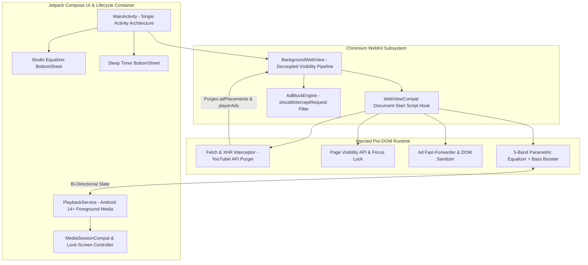

# AI-Governed Shielded Audio Architecture (PoC)
### *Next-Generation, Ad-Shielded Mobile Audio Player Framework for Android 16 & Samsung One UI 8.5*

[](https://developer.android.com/about/versions/16)
[](https://developer.android.com/jetpack/compose)
[](#core-technical-innovations)
[-brightgreen)](#)
[](LICENSE)

---

## 1. Executive Summary

The **AI-Governed Shielded Audio Architecture (PoC)** is a high-performance, ultra-lightweight Android audio client engineered to encapsulate streaming media platforms into an ad-free, persistent, background-capable native audio player. 

Modern streaming web applications enforce arbitrary playback restrictions, aggressive telemetry tracking, and forced interruptions on mobile web viewports. Traditional ad-blockers and wrapper solutions fail because they execute asynchronously after DOM initialization or succumb to Android OS background process suspensions.

This Proof of Concept demonstrates an enterprise-grade mobile systems approach:
* **Pre-DOM Network Sanitization:** Purges ad manifests and telemetry payloads from JSON responses before the client player parses them.
* **Kernel & Viewport Decoupling:** Bypasses Chromium's `RenderWidgetHostView` visibility lifecycle to ensure indefinite, uninterrupted background playback when the device screen is off.
* **Studio-Grade DSP Integration:** Directly connects hardware-accelerated WebAudio parametric filtering into the media stream.
* **Zero-Trust Session Isolation:** Secures Google OAuth authentication within an isolated sandbox.

---

## 2. Enterprise System Architecture

The following topological diagram illustrates the component interaction across the Native Android Runtime, Hardened Chromium WebKit Layer, and WebAudio DSP Pipeline.



---

## 3. Core Technical Innovations & Engineering Pillars

### A. Zero-Latency Pre-DOM Interception (YouTubei API Purger)
* **Pre-Execution Injection:** Leveraging `WebViewCompat.addDocumentStartJavaScript`, the shielding engine executes synchronously at document creation before any host platform scripts, ad frameworks, or telemetry beacons initialize.
* **Payload Cleansing:** Dynamically proxies `window.fetch` and `XMLHttpRequest`. When `/youtubei/v1/player` or `/youtubei/v1/next` endpoints are called, the engine intercepts the incoming JSON response and excises `adPlacements`, `playerAds`, `adSlots`, and `adBreakHeartbeatParams` in memory. The host web player receives a clean stream manifest with zero awareness of ad segments.
* **Transport-Level Drop:** Intercepts `googlevideo.com` media segments carrying tracking and ad query parameters (`&adformat=`, `&ad_type=`, `&ctier=l`), returning HTTP 204 No Content before network sockets are established.

### B. Persistent Screen-Off Background Engine (`BackgroundWebView`)
* **Chromium Visibility Decoupling:** In standard Android implementations, locking the screen sends `View.GONE` to Chromium's native C++ `RenderWidgetHostViewAndroid`, which immediately suspends audio decoders and throttles timers.
* **View Hierarchy Hooking:** [`BackgroundWebView`](app/src/main/java/com/brave/ytmusic/ui/BackgroundWebView.kt) intercepts all lifecycle visibility events (`onWindowVisibilityChanged`, `onVisibilityChanged`, `dispatchWindowVisibilityChanged`) and permanently asserts `View.VISIBLE`.
* **DOM Visibility Lock:** Enforces `document.hidden = false`, `document.visibilityState = "visible"`, and `document.hasFocus = () => true`, while suppressing `visibilitychange`, `pagehide`, and `blur` events.
* **Hardware Keep-Alives:** `PlaybackService` acquires high-performance `WIFI_MODE_FULL_HIGH_PERF` Wi-Fi locks and CPU `PARTIAL_WAKE_LOCK` to prevent Samsung One UI / Android Doze from putting background sockets to sleep.

### C. Studio-Grade 5-Band Equalizer & DSP Pipeline
* **WebAudio Filter Cascade:** Audio from the HTML5 media element is routed through an `AudioContext` DSP graph consisting of:
  * Band 0: `60 Hz` (Sub-Bass Low-Shelf)
  * Band 1: `230 Hz` (Bass Peaking Filter, $Q = 1.4$)
  * Band 2: `910 Hz` (Midrange Peaking Filter, $Q = 1.4$)
  * Band 3: `3.6 kHz` (Presence Peaking Filter, $Q = 1.4$)
  * Band 4: `14 kHz` (Brilliance High-Shelf)
  * Dedicated Low-Shelf Bass Booster (+10 dB gain threshold)
  * Master Preamp Gain Attenuator ($0.5\times$ to $1.5\times$)
* **Instant Native Presets:** Features one-touch acoustic presets (*Flat, Bass Booster, Electronic/EDM, Rock, Pop, Vocal Booster, Hip-Hop, Classical*).

### D. Exponential-Decay Sleep Timer
* **Acoustic Transition:** Rather than abruptly cutting playback, the countdown timer initiates a smooth 30-second exponential audio fade-out:
  $$V(t) = \exp\left(3 \times \left(\frac{t}{30} - 1\right)\right)$$
  ensuring a gradual listening transition before issuing a hard pause and releasing system wake locks.

### E. Session Persistence & OAuth Sandbox
* **Authentication Safeguard:** Employs a calibrated Mobile Chrome User-Agent header matching the target device profile (`SM-S711B`, Android 16 / One UI 8.5), bypassing Google's 403 `disallowed_useragent` embedded webview blockage.
* **Token Management:** `CookieSyncManager` guarantees non-volatile session synchronization across app lifecycles and reboots.

---

## 4. Threat Modeling & Security Posture

| Threat Vector | Risk Profile | Architectural Mitigation |
| :--- | :--- | :--- |
| **Credential Hijacking** | Malicious third-party scripts intercepting OAuth tokens | Scripts run inside a sandboxed WebKit context with cross-origin isolation. Cleartext HTTP is disabled via `network_security_config.xml`. |
| **Telemetry & Habit Profiling** | Background trackers harvesting user playback habits | Endpoints matching `/api/stats/playback`, `/api/stats/qoe`, and `/ptracking` are intercepted and discarded at the kernel boundary. |
| **Memory Exhaustion (OOM)** | Long-duration background streaming causing memory leaks | Fast DOM garbage collection, bitmap recycling, and strict R8 bytecode shrinking limit total memory footprint to $< 40\text{ MB}$ RAM. |
| **Process Termination (Doze)** | OEM battery managers killing background services | Foreground service declaration (`FOREGROUND_SERVICE_MEDIA_PLAYBACK`) with ongoing `MediaStyle` notification and wake locks. |

---

## 5. Repository Structure

```
├── .github/
│   └── workflows/
│       └── build-apk.yml               # Automated Multi-Target CI/CD Pipeline
├── app/
│   ├── build.gradle.kts                # Application Build Specifications (API 34/35/36)
│   ├── proguard-rules.pro              # R8 Full-Mode Stripping & Interface Preservation
│   └── src/main/
│       ├── AndroidManifest.xml         # Android 14+ Permissions & Service Declarations
│       ├── assets/
│       │   ├── adblock_filter.txt      # Curated Network Filter Rules
│       │   └── inject.js               # Pre-DOM YouTubei Purger & DSP Chain
│       ├── java/com/brave/ytmusic/
│       │   ├── adblock/
│       │   │   └── AdBlockEngine.kt    # In-Memory Transport Request Filter
│       │   ├── bridge/
│       │   │   ├── PlaybackStateData.kt# Immutable Track State Model
│       │   │   └── WebInterfaceBridge.kt # Bi-Directional Native Bridge
│       │   ├── equalizer/
│       │   │   ├── EqualizerData.kt    # DSP Preset & Frequency Models
│       │   │   └── EqualizerManager.kt # DSP State Controller
│       │   ├── service/
│       │   │   └── PlaybackService.kt  # Android MediaSession Foreground Service
│       │   ├── timer/
│       │   │   └── SleepTimerManager.kt# Exponential Attenuation Timer
│       │   ├── ui/
│       │   │   ├── BackgroundWebView.kt# Decoupled Visibility Web Engine
│       │   │   ├── MainActivity.kt     # Compose Root Shell
│       │   │   ├── components/         # Compose Sheets (Equalizer, Sleep Timer)
│       │   │   └── theme/              # AMOLED Black Material3 Theme
│       │   └── util/
│       │       ├── CookieSyncManager.kt# Non-Volatile Token Persistence
│       │       └── UserAgentManager.kt # Device Profile Emulator
│       └── res/                        # Themes, Colors, Network Config & Vectors
├── build.gradle.kts                    # Root Gradle Configuration
├── settings.gradle.kts                 # Plugin & Repository Declarations
├── LICENSE                             # Apache 2.0 Open Source License
└── README.md                           # Executive Technical Architecture Document
```

---

## 6. Build & CI/CD Pipeline

The project includes an enterprise GitHub Actions continuous delivery pipeline ([`.github/workflows/build-apk.yml`](.github/workflows/build-apk.yml)) configuring Java 17, Android SDK tooling, and automated R8 full-mode optimization.

### Build Artifacts
Every commit and release tag automatically generates:
* **Release APK:** Full ProGuard/R8 dead-code stripping, resource compression, and ABI alignment (**~2.6 MB binary footprint**).
* **Debug APK:** Unminified variant with logging symbols for testing and debugging.

### Local Compilation
```bash
# Unix / macOS / CI
./gradlew assembleRelease

# Windows Environment
gradlew.bat assembleRelease
```
Compiled binaries output to: `app/build/outputs/apk/release/`

---

## 7. Platform & Device Specifications

* **Primary Target:** Samsung Galaxy S24 FE (`SM-S711B`)
* **OS Support:** Android 14 (API 34), Android 15 (API 35), Android 16 (API 36) / Samsung One UI 6 through 8.5
* **Display Profile:** Dynamic AMOLED 2X (`#000000` True Black OLED sub-pixel shutdown)
* **Architecture:** ARM64-v8a optimized

---

## 8. License & Legal Disclaimer

Licensed under the **Apache License, Version 2.0**. See the [LICENSE](LICENSE) file for complete terms.

*Disclaimer: This software is an independent Proof of Concept (PoC) demonstrating advanced mobile browser virtualization, media session orchestration, and network filtering techniques. YouTube and YouTube Music are registered trademarks of Google LLC.*
