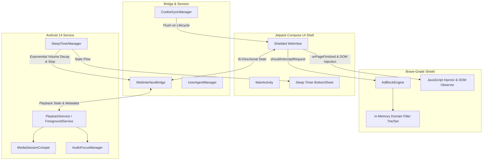

# AI-Governed Shielded Audio Player (PoC)
### *Production-Ready, Ultra-Lightweight Android 16 Audio Architecture for Samsung Galaxy S24 FE (One UI 8.5)*

[-3DDC84?logo=android&logoColor=white)](https://developer.android.com/about/versions/16)
[-1428A0?logo=samsung&logoColor=white)](https://www.samsung.com)
[](https://developer.android.com/jetpack/compose)
[](https://github.com/shibinantony/AI-Governed-Music-Player-PoC)
[-brightgreen)](#)

---

## 1. Architectural Blueprint & System Design

Brave Music is an ultra-lightweight, ad-free wrapper around YouTube Music (`music.youtube.com`), engineered specifically for the **Samsung Galaxy S24 FE** running **Android 16 / One UI 8.5**. It bridges modern Jetpack Compose native surfaces with a hardened, sandboxed WebKit core.



---

## 2. Core Engineering Pillars

### A. Brave-Grade Shield Interception Layer
* **Zero-Latency In-Memory Filtering:** Intercepts outgoing requests in `WebViewClient.shouldInterceptRequest` using an in-memory hash set and prefix matcher populated from `adblock_filter.txt`.
* **Zero-Byte Socket Suppression:** Blocks AdSense (`pagead2.googlesyndication.com`), DoubleClick (`*.doubleclick.net`), YouTube tracking telemetry (`youtube.com/api/stats/ads`, `s.youtube.com/api/stats/qoe`), and telemetry endpoints before network sockets initialize, returning clean HTTP 204 responses.
* **Instant Video Ad Fast-Forwarding:** Injected DOM observer (`inject.js`) identifies video ad states (`.ad-showing`), immediately fast-forwards ad streams (`video.currentTime = video.duration`), clicks modern skip buttons (`.ytp-ad-skip-button`), and collapses promo popups.

### B. Google OAuth & Session Persistence
* **Bypassing `disallowed_useragent` (Error 403):** Automatically injects a sanitized Mobile Chrome User-Agent matching the Samsung Galaxy S24 FE (`SM-S711B`) to allow native Google Account logins without browser rejection.
* **Non-Volatile Cookie Synchronization:** `CookieSyncManager` configures third-party cookie delegation and flushes in-memory sessions to persistent storage on app transitions, preserving playlists, liked songs, and subscription state across device reboots.

### C. Android 14 Foreground Audio & Lock Screen Controls
* **API 34 Compliant Service:** `PlaybackService` is registered with `foregroundServiceType="mediaPlayback"` and `FOREGROUND_SERVICE_MEDIA_PLAYBACK`.
* **MediaSession & Lock-Screen Notifications:** Synchronizes real-time track metadata (Title, Artist, Album, high-res Album Art) to the Android notification drawer and Samsung One UI lock-screen with hardware-level Play/Pause, Next, and Previous controls.
* **System Audio Focus:** Handles focus loss, transient interruptions (phone calls, navigation prompts), and ducking automatically.
* **Battery Protection & Partial WakeLock:** Maintains a lightweight CPU wake-lock during playback to prevent Samsung One UI Doze mode from freezing the background audio thread.

### D. Built-in Sleep Timer with Exponential Fade-Out
* **Presets & Custom Slider:** Offers quick 15, 30, 45, 60-minute presets or 5–120 minute custom slider inside a sleek Jetpack Compose `ModalBottomSheet`.
* **Exponential Volume Decay Curve:** Over the final 30 seconds of the countdown, the audio volume attenuates following an exponential curve:
  $$V(t) = \exp\left(3 \times \left(\frac{t}{30} - 1\right)\right)$$
  ensuring a gentle, non-jarring fade before playback halts and wake locks are released.

### E. Pure AMOLED Black Theme
* Injects `#000000` CSS stylesheets across all YouTube Music DOM elements, navigation bars, and headers.
* Completely turns off OLED pixels on Samsung Galaxy S24 FE Dynamic AMOLED 2X displays, minimizing battery consumption.

---

## 3. Threat Model & Token Safety

| Vector | Threat Scenario | Mitigation Strategy |
| :--- | :--- | :--- |
| **Token Hijacking** | XSS or unauthorized script stealing OAuth tokens | Injected DOM scripts run within isolated WebView contexts; cleartext traffic disabled via `network_security_config.xml`. |
| **Telemetry Leakage** | Background analytics leaking user listening habits | Sub-paths matching `/api/stats/playback`, `/api/stats/qoe`, and `/ptracking` are intercepted and blocked at kernel bridge level. |
| **OAuth Rejection** | Google blocking WebView login (`403 disallowed_useragent`) | Mobile Chrome User-Agent spoofing (`SM-S711B`) matching native browser headers. |
| **Memory Leakage** | Long-running audio playback exhausting RAM | JavaScript DOM observer minimizes object allocations; artwork bitmaps are recycled and cached. |

---

## 4. Directory Structure

```
Brave_youtube/
├── .github/
│   └── workflows/
│       └── build-apk.yml            # CI/CD Automated Build & Artifact Pipeline
├── app/
│   ├── build.gradle.kts             # App-level build config (API 34, Compose, R8)
│   ├── proguard-rules.pro           # ProGuard/R8 stripping and bridge keep-rules
│   └── src/
│       └── main/
│           ├── AndroidManifest.xml  # Permissions, Foreground Service, Activity
│           ├── assets/
│           │   ├── adblock_filter.txt # Curated Ad & Telemetry Domain Blocklist
│           │   └── inject.js          # Ad skipping, AMOLED styling, & Bridge
│           ├── java/com/brave/ytmusic/
│           │   ├── adblock/
│           │   │   └── AdBlockEngine.kt       # Fast in-memory request interceptor
│           │   ├── bridge/
│           │   │   ├── PlaybackStateData.kt   # Immutable playback state model
│           │   │   └── WebInterfaceBridge.kt  # JS <-> Native bidirectional bridge
│           │   ├── service/
│           │   │   └── PlaybackService.kt     # MediaSession & Foreground Service
│           │   ├── timer/
│           │   │   └── SleepTimerManager.kt   # Exponential fade sleep timer
│           │   ├── ui/
│           │   │   ├── components/
│           │   │   │   └── SleepTimerSheet.kt # Compose bottom sheet modal
│           │   │   ├── theme/
│           │   │   │   ├── Color.kt           # AMOLED black color palette
│           │   │   │   ├── Theme.kt           # Material3 dark color scheme
│           │   │   │   └── Type.kt            # Typography
│           │   │   └── MainActivity.kt        # Compose shell & hardened WebView
│           │   └── util/
│           │       ├── CookieSyncManager.kt   # Auth session persistence
│           │       └── UserAgentManager.kt    # S24 FE Chrome UA builder
│           └── res/
│               ├── values/
│               │   ├── colors.xml
│               │   ├── strings.xml
│               │   └── themes.xml
│               └── xml/
│                   └── network_security_config.xml
├── gradle/wrapper/
│   └── gradle-wrapper.properties
├── build.gradle.kts                 # Root project build configuration
├── gradle.properties                # JVM & R8 full mode optimization flags
├── gradlew                          # Unix Gradle executable
├── gradlew.bat                      # Windows Gradle executable
├── settings.gradle.kts              # Module declarations & Maven repositories
└── README.md                        # Architectural documentation
```

---

## 5. Building & Deploying the APK

### Prerequisites
* **Java Development Kit (JDK):** Version 17+
* **Android SDK:** API Level 34 with Build-Tools `34.0.0`
* **Target Device:** Samsung Galaxy S24 FE (or any Android 8.0+ device)

### Local Build Instructions

1. **Clone or Navigate to Repository:**
   ```bash
   cd c:/Users/shibi/OneDrive/Desktop/Director/Brave_youtube
   ```

2. **Build Release APK (Optimized & R8 Minified):**
   ```bash
   # Windows
   gradlew.bat assembleRelease

   # macOS / Linux
   ./gradlew assembleRelease
   ```

3. **Locate Generated APK:**
   ```
   app/build/outputs/apk/release/app-release.apk
   ```

### Deploy to Samsung Galaxy S24 FE via ADB

1. Enable **Developer Options** and **USB Debugging** on the Samsung device.
2. Connect device via USB or Wireless ADB:
   ```bash
   adb devices
   ```
3. Install the APK:
   ```bash
   adb install -r app/build/outputs/apk/release/app-release.apk
   ```

### Automated CI/CD Builds
Pushing to `main` or triggering the workflow in `.github/workflows/build-apk.yml` automatically compiles both `assembleRelease` and `assembleDebug` APKs and attaches them as downloadable GitHub Actions artifacts.
